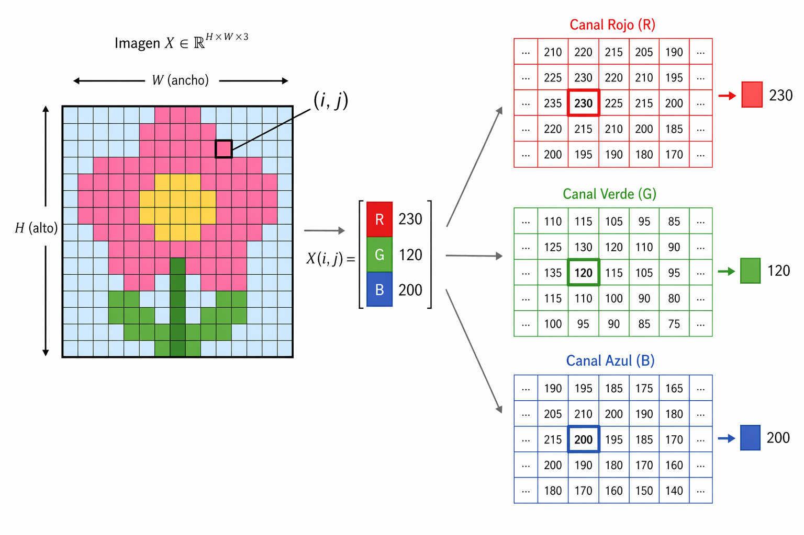
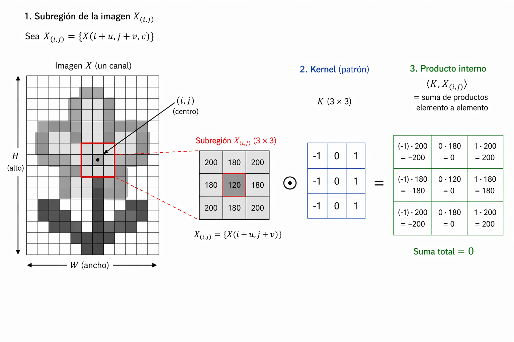
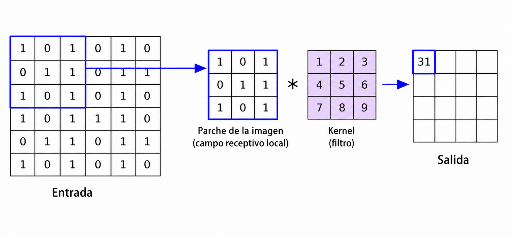
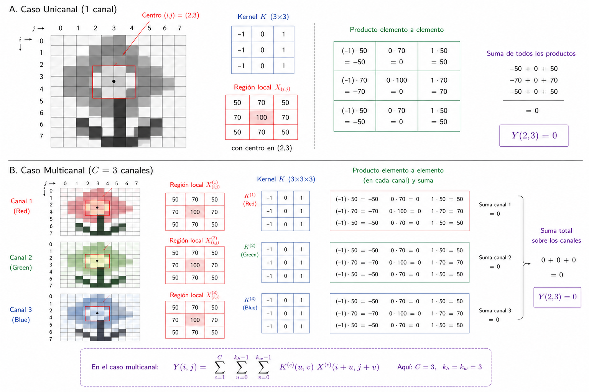
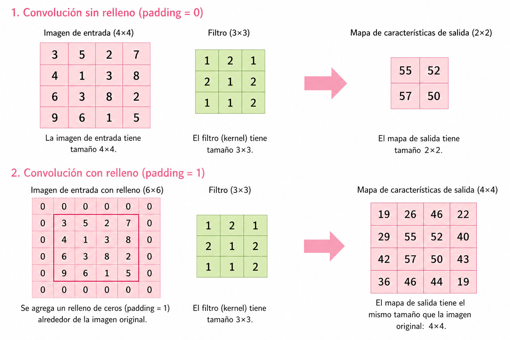
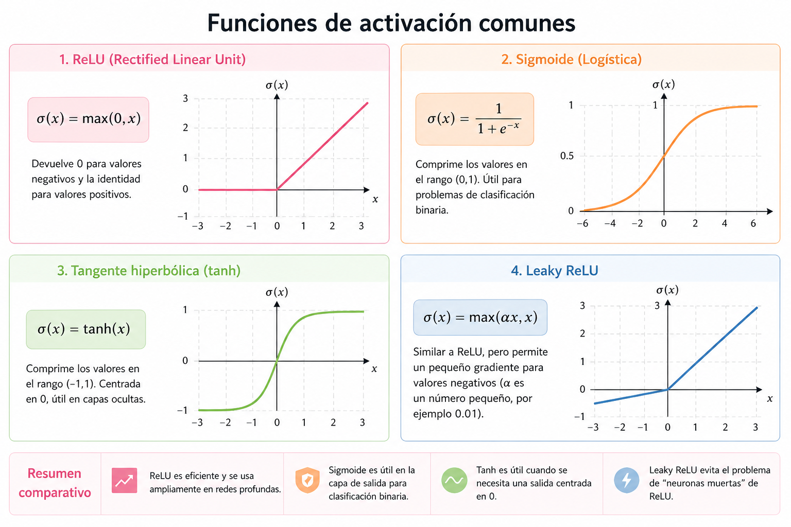
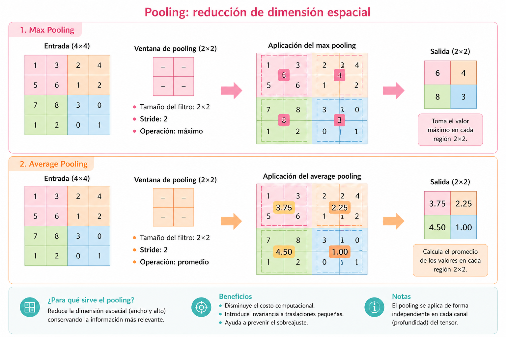

---
author:
  - name: Mariana Belén Cruz Rodríguez
    email: mariana.cruz68@unach.mx
    corresponding: true
  - name: Yofre Hernán García Gómez
    degrees: PhD
    email: yofre.garcia@unach.mx
    roles: supervisor
    corresponding: true
number-sections: true
crossref:
  eq-prefix: "Ecuación"
---

# Introducción

En este trabajo se aborda el problema de **reconocimiento automático de glifos del alfabeto náhuatl** mediante el uso de redes neuronales convolucionales (*Convolutional Neural Networks*, CNN). Este problema puede formularse como una tarea de clasificación de imágenes, en la cual cada glifo es representado mediante una estructura matricial que codifica su información visual.

Los glifos presentan variaciones en forma, trazo y estilo, lo que dificulta su identificación mediante métodos tradicionales. En este contexto, las CNN resultan particularmente adecuadas debido a su capacidad para extraer características espaciales relevantes directamente a partir de los datos, tales como bordes, curvas y patrones geométricos distintivos.

# Formulación Matemática de una CNN

Una red neuronal convolucional puede modelarse como una aplicación parametrizada:

$$
f(\cdot , \theta): \mathcal{X} \subseteq \mathbb{R}^{H \times W \times C} \longrightarrow \mathbb{R}^{k}
$$ {#eq-cnn-formal}

donde:

- $\mathcal{X}$ es el espacio de entrada (por ejemplo, imágenes),
- $H$ representa la altura (height) de la imagen, es decir, el número de filas,
- $W$ representa el ancho (width), es decir, el número de columnas,
- $C$ representa el número de canales (channels), que corresponde a la cantidad de valores asociados a cada píxel,
- $k$ es la dimensión del espacio de salida (por ejemplo, número de clases en clasificación),
- $\theta$ denota el conjunto total de parámetros entrenables del modelo.

# Representación Tensorial de Imágenes

Una imagen digital se representa como un tensor de orden tres:

$$
X \in \mathbb{R}^{H \times W \times C}
$$ {#eq-imagen-tensor}

Esto implica que para cada posición espacial $(i,j)$:

$$
X(i,j) = \left(x_1, x_2, \dots, x_C \right) \in \mathbb{R}^C
$$ {#eq-pixel-vector}

Por tanto, cada píxel contiene un vector que describe información en distintos canales.

# Estructura Funcional de la Red

Una CNN se construye como la composición de funciones:

$$
f(x;\theta) = f^{(L)} \circ f^{(L-1)} \circ \cdots \circ f^{(1)}(x)
$$ {#eq-composicion-cnn}

donde $L \in \mathbb{N}$ es el número total de capas de la red y cada $f^{(l)}$ representa una transformación asociada a la capa $l$-ésima.

Asimismo, los parámetros globales se expresan como:

$$
\theta = \left\{ \theta^{(1)}, \theta^{(2)}, \dots, \theta^{(L)} \right\}
$$ {#eq-parametros-globales}

# Parámetros del Modelo

Los parámetros de una CNN están constituidos principalmente por:

- **Kernels** (filtros convolucionales),
- **Sesgos** asociados a cada filtro.

Estos parámetros determinan completamente la función $f(x;\theta)$ y son ajustados mediante procedimientos de optimización basados en gradiente.

# Kernels Convolucionales

## Definición Formal

Un kernel es un tensor de parámetros que define un operador lineal local.

**Caso unicanal:**

$$
K \in \mathbb{R}^{k_h \times k_w}
$$ {#eq-kernel-unicanal}

cuyos elementos se indexan como:

$$
K(u,v), \quad
u \in \{0,\dots,k_h-1\}, \;
v \in \{0,\dots,k_w-1\}
$$

**Caso multicanal:**

$$
K \in \mathbb{R}^{k_h \times k_w \times C}
$$ {#eq-kernel-multicanal}

con entradas:

$$
K(u,v,c), \quad
u \in \{0,\dots,k_h-1\}, \;
v \in \{0,\dots,k_w-1\}, \;
c \in \{1,\dots,C\}
$$

## Interpretación Geométrica

Sea $X_{(i,j)}$ una subregión de la imagen obtenida al centrar el kernel en la posición $(i,j)$, cuyos elementos están dados por:

$$
X(i+u, j+v, c)
$$

para los mismos índices $(u,v,c)$ definidos anteriormente.

El producto interno:

$$
\langle K, X_{(i,j)} \rangle
$$ {#eq-producto-interno}

mide la similitud entre el patrón definido por el kernel y la región local de la imagen.

## Compartición de parámetros

Una propiedad fundamental de las redes neuronales convolucionales es la **compartición de parámetros**, la cual establece que los coeficientes del kernel no dependen de la posición espacial en la que se aplica la operación.

Formalmente, si $K$ es un kernel convolucional, entonces:

$$
K(u,v,c) \text{ es independiente de la posición } (i,j)
$$

Esto implica que el mismo kernel es utilizado para procesar todas las regiones locales de la entrada.

### Reducción del número de parámetros

En ausencia de compartición de parámetros, cada posición $(i,j)$ requeriría un conjunto distinto de pesos, lo cual conduciría a un número total de parámetros del orden:

$$
H \cdot W \cdot k_h \cdot k_w \cdot C
$$

Sin embargo, al emplear un único kernel compartido, el número de parámetros se reduce a:

$$
k_h \cdot k_w \cdot C
$$

lo cual representa una reducción significativa en la complejidad del modelo.

### Invarianza traslacional

La compartición de parámetros induce una propiedad de **equivarianza por traslación**. Sea $\tau_{a,b}$ un operador de traslación definido sobre la entrada. Entonces, la operación de convolución satisface:

$$
\mathcal{T}_K(\tau_{a,b} X) = \tau_{a,b} (\mathcal{T}_K X)
$$ {#eq-equivarianza}

Esto implica que si una característica aparece en diferentes posiciones espaciales, el modelo será capaz de detectarla de manera consistente.

En consecuencia, la red no depende de la posición absoluta de los patrones, sino únicamente de su estructura local.

# Operación de Convolución

La operación fundamental en una red neuronal convolucional es la denominada **convolución discreta**. No obstante, es importante señalar que en el contexto de aprendizaje profundo, la operación implementada corresponde en realidad a la **correlación cruzada**, ya que no se realiza la inversión del kernel. A pesar de esta diferencia técnica, en la literatura se mantiene el término ``convolución'' por convención.

Esta operación define un mecanismo mediante el cual se evalúa la similitud entre un patrón local (kernel) y distintas regiones de la imagen de entrada.

## Caso Unicanal

Sea una imagen unicanal representada por:

$$
X \in \mathbb{R}^{H \times W}
$$

y un kernel:

$$
K \in \mathbb{R}^{k_h \times k_w}
$$

La operación de convolución produce una salida $Y$, definida en cada posición $(i,j)$ como:

$$
Y(i,j) =
\sum_{u=0}^{k_h-1}
\sum_{v=0}^{k_w-1}
K(u,v)\, X(i+u, j+v)
$$ {#eq-convolucion-unicanal}

donde:

- $(i,j)$ denota la posición de la ventana deslizante,
- $(u,v)$ recorre las coordenadas internas del kernel,
- $X(i+u, j+v)$ representa la región local de la imagen.

### Interpretación como ventana deslizante

La ecuación anterior describe un proceso en el cual el kernel se desplaza sistemáticamente sobre la imagen. En cada posición, se selecciona una submatriz de $X$ de dimensiones $k_h \times k_w$, sobre la cual se realiza una operación de agregación ponderada.

Formalmente, definimos la submatriz local como:

$$
X_{(i,j)} = \left\{ X(i+u, j+v) \right\}_{u,v}
$$

Por lo tanto, la salida en $(i,j)$ depende únicamente de una vecindad local de la imagen, lo cual establece la propiedad de **conectividad local**.

### Interpretación como producto interno

La expresión de la convolución puede reescribirse como un producto interno en el espacio vectorial $\mathbb{R}^{k_h \times k_w}$:

$$
Y(i,j) = \langle K, X_{(i,j)} \rangle
$$ {#eq-producto-interno-conv}

donde el producto interno se define como:

$$
\langle A, B \rangle = \sum_{u=0}^{k_h-1} \sum_{v=0}^{k_w-1} A(u,v)\, B(u,v)
$$

Esta formulación pone de manifiesto que la convolución mide el grado de alineación entre el kernel y la región local.

### Interpretación geométrica

Desde un punto de vista geométrico, el valor $Y(i,j)$ representa la proyección del vector $X_{(i,j)}$ sobre el vector $K$ en el espacio euclidiano de dimensión $k_h k_w$. En consecuencia:

- Si $X_{(i,j)}$ es similar a $K$, entonces $Y(i,j)$ será grande.
- Si son ortogonales, el resultado será cercano a cero.
- Si son opuestos, el valor será negativo.

Esto permite interpretar al kernel como un **detector de patrones**.

### Naturaleza lineal de la operación

La convolución es un operador lineal. Es decir, para cualesquiera tensores $X_1, X_2$ y escalares $\alpha, \beta$, se cumple:

$$
\mathcal{T}_K(\alpha X_1 + \beta X_2)
= \alpha \mathcal{T}_K(X_1) + \beta \mathcal{T}_K(X_2)
$$ {#eq-linealidad}

donde $\mathcal{T}_K$ denota el operador de convolución asociado al kernel $K$.

### Relación con la correlación cruzada

Es importante destacar que la definición utilizada en redes neuronales corresponde a la correlación cruzada:

$$
Y(i,j) =
\sum_{u,v} K(u,v)\, X(i+u, j+v)
$$

mientras que la convolución clásica implicaría una inversión del kernel:

$$
Y(i,j) =
\sum_{u,v} K(u,v)\, X(i-u, j-v)
$$

Sin embargo, dado que los parámetros del kernel son aprendidos durante el entrenamiento, ambas formulaciones resultan equivalentes en términos de capacidad representacional.

### Dependencia local

Finalmente, se observa que:

$$
Y(i,j) \text{ depende únicamente de } X_{(i,j)}
$$

lo cual implica que cada salida está influenciada únicamente por una región local de la entrada. Esta propiedad es clave para la eficiencia computacional y la capacidad de generalización del modelo.

## Convolución Multicanal

En el caso general, las imágenes no son unicanal, sino que poseen múltiples canales (por ejemplo, RGB). En consecuencia, la operación de convolución debe extenderse para considerar simultáneamente la información presente en cada canal.

Sea:

$$
X \in \mathbb{R}^{H \times W \times C}
$$

una imagen con $C$ canales, y sea un kernel:

$$
K \in \mathbb{R}^{k_h \times k_w \times C}
$$

donde cada canal del kernel corresponde a un canal de la entrada.

La salida de la convolución en la posición $(i,j)$ está dada por:

$$
Y(i,j) =
\sum_{c=1}^{C}
\sum_{u=0}^{k_h-1}
\sum_{v=0}^{k_w-1}
K(u,v,c)\, X(i+u,j+v,c)
$$ {#eq-convolucion-multicanal}

Esta expresión indica que la contribución de cada canal se calcula de manera independiente y posteriormente se agregan (suman) todas las contribuciones.

La operación anterior puede interpretarse como la suma de convoluciones unicanal:

$$
Y(i,j) = \sum_{c=1}^{C} Y^{(c)}(i,j)
$$

donde:

$$
Y^{(c)}(i,j) =
\sum_{u=0}^{k_h-1}
\sum_{v=0}^{k_w-1}
K(u,v,c)\, X(i+u,j+v,c)
$$

Cada término $Y^{(c)}(i,j)$ representa la contribución del canal $c$ al valor final de la salida.

## Interpretación como producto interno en espacio tensorial

Sea $X_{(i,j)}$ la subregión local de la imagen centrada en $(i,j)$. Entonces:

$$
X_{(i,j)} \in \mathbb{R}^{k_h \times k_w \times C}
$$

Al vectorizar ambos tensores:

$$
\mathrm{vec}(X_{(i,j)}) \in \mathbb{R}^{k_h k_w C}, \quad
\mathrm{vec}(K) \in \mathbb{R}^{k_h k_w C}
$$

la convolución puede escribirse como:

$$
Y(i,j) = \mathrm{vec}(K)^\top \mathrm{vec}(X_{(i,j)})
$$ {#eq-vectorizacion}

Esto muestra que la operación es un producto interno en un espacio euclidiano de dimensión $k_h k_w C$.

## Interpretación geométrica

Desde un punto de vista geométrico, cada región local de la imagen se interpreta como un punto en el espacio $\mathbb{R}^{k_h k_w C}$, y el kernel define una dirección en dicho espacio.

Por tanto:

- valores grandes de $Y(i,j)$ indican alta alineación entre el patrón y la región,
- valores cercanos a cero indican baja correlación,
- valores negativos indican oposición estructural.

En consecuencia, el kernel actúa como un detector de patrones multicanal.

## Naturaleza lineal

La convolución multicanal es un operador lineal. Es decir, para cualesquiera tensores $X_1, X_2$ y escalares $\alpha, \beta$, se cumple:

$$
\mathcal{T}_K(\alpha X_1 + \beta X_2)
=
\alpha \mathcal{T}_K(X_1) + \beta \mathcal{T}_K(X_2)
$$

donde $\mathcal{T}_K$ denota el operador de convolución asociado al kernel $K$.

## Interpretación estructural

Es importante destacar que, a diferencia del caso unicanal, el kernel multicanal no detecta únicamente patrones espaciales, sino también **correlaciones entre canales**.

Por ejemplo, en imágenes RGB, el kernel puede aprender a identificar combinaciones específicas de intensidades en los canales rojo, verde y azul, lo cual permite detectar patrones más complejos que aquellos basados únicamente en estructura espacial.

## Forma Vectorizada

$$
Y(i,j) = K^\top X_{(i,j)}
$$

# Múltiples Filtros

En una red neuronal convolucional, no se utiliza un único kernel, sino un conjunto de filtros que permiten extraer distintas características de la entrada. Este conjunto se denota como:

$$
\left\{ K^{(f)} \right\}_{f=1}^{F}, \quad
K^{(f)} \in \mathbb{R}^{k_h \times k_w \times C}
$$ {#eq-conjunto-filtros}

donde $F$ representa el número total de filtros.

## Definición de la salida

Cada filtro $K^{(f)}$ actúa de manera independiente sobre la entrada y produce un mapa de activación asociado. Para cada posición $(i,j)$, la salida correspondiente al filtro $f$ está dada por:

$$
Y_f(i,j) = \langle K^{(f)}, X_{(i,j)} \rangle
$$ {#eq-salida-filtro}

Por lo tanto, a cada filtro le corresponde una función:

$$
Y_f : \{1,\dots,H'\} \times \{1,\dots,W'\} \to \mathbb{R}
$$

## Estructura tensorial de la salida

Al considerar todos los filtros simultáneamente, la salida completa se organiza como un tensor de orden tres:

$$
Y \in \mathbb{R}^{H' \times W' \times F}
$$ {#eq-salida-tensor}

donde:

- $H'$ y $W'$ son las dimensiones espaciales de la salida,
- $F$ es el número de canales de salida, también llamados **mapas de características**.

En particular, la componente $Y(:,:,f)$ corresponde al mapa de activación generado por el filtro $K^{(f)}$.

## Interpretación funcional

Cada filtro puede interpretarse como un detector especializado en cierto tipo de patrón. En consecuencia, la colección de filtros define una familia de funciones:

$$
\left\{ \mathcal{T}_{K^{(f)}} \right\}_{f=1}^{F}
$$

donde cada operador $\mathcal{T}_{K^{(f)}}$ extrae una característica distinta de la entrada.

De este modo, la salida de la capa puede interpretarse como la aplicación conjunta de múltiples detectores, produciendo una representación enriquecida de la imagen.

## Interpretación como vector de características local

Para cada posición $(i,j)$, la salida puede agruparse como un vector:

$$
Y(i,j) = \left( Y_1(i,j), Y_2(i,j), \dots, Y_F(i,j) \right) \in \mathbb{R}^{F}
$$ {#eq-vector-local}

Esto implica que cada posición espacial de la imagen original es transformada en un vector de características de dimensión $F$.

Por tanto, la capa convolucional realiza una transformación:

$$
\mathbb{R}^{k_h \times k_w \times C}
\longrightarrow
\mathbb{R}^{F}
$$

aplicada localmente en cada vecindad de la imagen.

## Interpretación geométrica

Desde una perspectiva geométrica, cada filtro $K^{(f)}$ define una dirección en el espacio $\mathbb{R}^{k_h k_w C}$. En consecuencia, el vector $Y(i,j)$ contiene las proyecciones de la región local $X_{(i,j)}$ sobre cada una de estas direcciones.

Esto permite interpretar la salida como una representación de la información local en una base (no necesariamente ortogonal) definida por los filtros aprendidos.

## Ejemplos de filtros

Los distintos filtros convolucionales permiten detectar características específicas en la imagen de entrada. A continuación, se muestran ejemplos representativos del efecto de diferentes kernels sobre una misma imagen.

## Observación estructural

Es importante notar que el número de filtros $F$ determina la capacidad de representación de la capa. Un mayor número de filtros permite capturar una mayor variedad de patrones, pero también incrementa el número de parámetros y el costo computacional.

En capas profundas, los filtros tienden a representar características de mayor nivel semántico, construidas a partir de combinaciones de patrones detectados en capas anteriores.

# Stride y Padding

## Stride

El *stride* $s$ controla el desplazamiento del kernel durante la operación de convolución. Es decir, determina cuántas posiciones se desplaza el kernel en cada paso.

Las dimensiones de salida están dadas por:

$$
H' = \left\lfloor \frac{H - k_h + 2p}{s} \right\rfloor + 1, \quad
W' = \left\lfloor \frac{W - k_w + 2p}{s} \right\rfloor + 1
$$ {#eq-output-dims}

donde:

- $H, W$ son las dimensiones de la entrada,
- $k_h, k_w$ son las dimensiones del kernel,
- $p$ es el padding,
- $s$ es el stride.

Un valor mayor de $s$ produce una reducción en la resolución espacial de la salida.

## Padding

El *padding* es una operación que consiste en añadir valores (generalmente ceros) alrededor de la entrada antes de aplicar la convolución. Esto se hace para controlar el tamaño de la salida y preservar información en los bordes.

$$
X_{\text{pad}} \in \mathbb{R}^{(H+2p)\times(W+2p)\times C}
$$

El padding puede interpretarse como una extensión de la función de entrada $X$ fuera de su dominio original. Formalmente, se define la extensión $\tilde{X}$ como:

$$
\tilde{X}(i,j) =
\begin{cases}
X(i,j), & \text{si } (i,j) \text{ pertenece al dominio original}, \\
0, & \text{en otro caso}
\end{cases}
$$

Esta extensión corresponde a una extensión por cero del dominio de la función.

En una capa convolucional, el padding se aplica antes de la convolución. Por lo tanto, la operación completa de una capa convolucional con padding se puede expresar como:

$$
Y = \sigma\big( (\text{pad}(X)) \star K + b \big)
$$

donde:

- $X$ es el tensor de entrada,
- $\text{pad}(X)$ es la entrada extendida mediante padding,
- $\star$ denota la operación de correlación cruzada,
- $K$ es el kernel o filtro,
- $b$ es el sesgo,
- $\sigma$ es la función de activación.

## Ejemplo ilustrativo

Para ilustrar el efecto del padding sobre las dimensiones de salida, se presenta el siguiente ejemplo:

{#fig-padding fig-align="center" width=80%}

Como se observa en @fig-padding, la incorporación de padding permite controlar el tamaño de la salida. En particular, cuando se utiliza padding adecuado, es posible preservar las dimensiones espaciales de la imagen original tras la aplicación de la convolución.

## Función de activación

Una función de activación es una aplicación no lineal que se introduce después de una transformación afín, con el objetivo de dotar al modelo de la capacidad de aproximar funciones no lineales.

### Definición

Sea $x \in \mathbb{R}^n$ un vector de entrada, $w \in \mathbb{R}^n$ un vector de pesos y $b \in \mathbb{R}$ un sesgo. Se define la preactivación como:

$$
z = w^T x + b
$$ {#eq-preactivacion}

La salida de la neurona está dada por:

$$
y = \sigma(z)
$$ {#eq-activacion}

donde $\sigma : \mathbb{R} \to \mathbb{R}$ es la función de activación.

### No linealidad

Considérese una red neuronal profunda compuesta únicamente por transformaciones afines. En tal caso, la composición de dichas transformaciones satisface:

$$
f(x) = W_L W_{L-1} \cdots W_1 x + b'
$$

lo cual sigue siendo una transformación afín. Por consiguiente, sin la introducción de funciones de activación no lineales, la red carece de capacidad expresiva para modelar relaciones no lineales.

En una red neuronal convolucional (CNN), la salida de una capa se expresa como:

$$
Y = \sigma\big( X \star K + b \big)
$$ {#eq-cnn-activacion}

donde:

- $X$ es el tensor de entrada  
- $\star$ denota la operación de correlación cruzada  
- $K$ es el conjunto de filtros (kernels)  
- $b$ es el sesgo  
- $\sigma$ se aplica elemento a elemento  

### Ejemplos de funciones de activación

Algunas de las funciones de activación más utilizadas son las siguientes:
{#fig-activaciones fig-align="center" width=80%}

#### ReLU (Rectified Linear Unit)

$$
\sigma(x) = \max(0, x)
$$ {#eq-relu}

#### Sigmoide

$$
\sigma(x) = \frac{1}{1 + e^{-x}}
$$ {#eq-sigmoide}

#### Tangente hiperbólica

$$
\sigma(x) = \tanh(x)
$$ {#eq-tanh}

### Propiedades fundamentales

Las funciones de activación empleadas en redes neuronales satisfacen típicamente:

- No linealidad, necesaria para incrementar la capacidad de representación del modelo  
- Aplicación puntual (element-wise), preservando la estructura espacial en CNN  
- Diferenciabilidad (al menos casi en todas partes), requisito esencial para métodos de optimización basados en gradiente  

### Formulación funcional

Desde una perspectiva funcional, una red neuronal profunda puede interpretarse como la composición de aplicaciones de la forma:

$$
f_\theta = \sigma_L \circ T_L \circ \cdots \circ \sigma_1 \circ T_1
$$ {#eq-deep-functional}

donde cada transformación afín está dada por:

$$
T_i(x) = W_i x + b_i
$$

## Pooling

El *pooling* es una operación que reduce la dimensión espacial de la representación, conservando las características más relevantes. Esta operación se aplica de manera independiente en cada canal del tensor de entrada.

Sea:

$$
X \in \mathbb{R}^{H \times W \times C}
$$

la entrada de la capa. El pooling produce una salida:

$$
Y \in \mathbb{R}^{H' \times W' \times C}
$$

donde las dimensiones $H'$ y $W'$ son menores que $H$ y $W$.

### Max Pooling

El *max pooling* es la forma más común de pooling. Para cada región local $X_{(i,j)}$, se define:

$$
Y(i,j,c) = \max_{(u,v) \in \mathcal{R}} X(i+u, j+v, c)
$$ {#eq-maxpool}

donde $\mathcal{R}$ representa la ventana de pooling (por ejemplo, de tamaño $2 \times 2$).

### Average Pooling

Otra variante es el *average pooling*, definido como:

$$
Y(i,j,c) = \frac{1}{|\mathcal{R}|} \sum_{(u,v) \in \mathcal{R}} X(i+u, j+v, c)
$$ {#eq-avgpool}

{#fig-pooling fig-align="center" width=80%}

### Propiedades

El pooling presenta las siguientes propiedades:

- Reduce la dimensionalidad espacial, disminuyendo el costo computacional  
- Introduce una cierta invariancia a traslaciones pequeñas  
- Opera de forma independiente en cada canal  

### Interpretación

El pooling puede interpretarse como una forma de resumen local de la información. En el caso del max pooling, se selecciona la característica más prominente dentro de cada región, mientras que el average pooling produce una media de las intensidades.

En arquitecturas profundas, el pooling contribuye a la construcción de representaciones más abstractas, al reducir progresivamente la resolución espacial.

## Capas completamente conectadas

Las capas completamente conectadas (*Fully Connected*, FC) constituyen la etapa final de una red neuronal convolucional. Su función es combinar las características extraídas por las capas anteriores para realizar la tarea de clasificación o regresión.

### Vectorización de la entrada

Sea:

$$
X \in \mathbb{R}^{H \times W \times C}
$$

la salida de la última capa convolucional. Esta se transforma en un vector mediante una operación de vectorización:

$$
x = \mathrm{vec}(X) \in \mathbb{R}^{HWC}
$$ {#eq-vectorizacion-fc}

### Transformación afín

La capa completamente conectada aplica una transformación lineal seguida de un sesgo:

$$
z = Wx + b
$$ {#eq-fc-lineal}

donde:

- $W \in \mathbb{R}^{k \times HWC}$ es la matriz de pesos  
- $b \in \mathbb{R}^{k}$ es el vector de sesgos  
- $k$ es el número de neuronas en la capa  

### Aplicación de la función de activación

La salida de la capa está dada por:

$$
y = \sigma(z)
$$ {#eq-fc-activacion}

donde $\sigma$ es una función de activación aplicada componente a componente.

### Interpretación

Las capas completamente conectadas pueden interpretarse como clasificadores que operan sobre las características extraídas por la red convolucional. En particular, cada neurona combina toda la información disponible en la representación vectorizada.

Esto contrasta con las capas convolucionales, donde la conectividad es local.

### Clasificación

En problemas de clasificación multiclase, la última capa suele utilizar la función *softmax*, definida como:

$$
\text{softmax}(z_i) =
\frac{e^{z_i}}{\sum_{j=1}^{k} e^{z_j}}
$$ {#eq-softmax}

Esta función transforma el vector $z$ en una distribución de probabilidad sobre las clases.

### Propiedades

Las capas completamente conectadas presentan las siguientes características:

- Conectividad global: cada neurona está conectada con todas las entradas  
- Alta capacidad de representación  
- Mayor número de parámetros en comparación con capas convolucionales  

### Observación

Debido al elevado número de parámetros, las capas completamente conectadas son más propensas al sobreajuste. Por esta razón, en arquitecturas modernas, su uso se reduce o se reemplaza parcialmente mediante técnicas como *global average pooling*.

## Función de pérdida

La función de pérdida (*loss function*) cuantifica la discrepancia entre las predicciones del modelo y los valores reales. Constituye el criterio fundamental que guía el proceso de entrenamiento, ya que permite evaluar la calidad de las predicciones y definir un objetivo de optimización.

### Definición general

Sea $f_\theta(x)$ la salida del modelo para una entrada $x$, y sea $y$ la etiqueta real asociada. Una función de pérdida se define como:

$$
\mathcal{L}(f_\theta(x), y)
$$

donde $\mathcal{L} : \mathbb{R}^k \times \mathbb{R}^k \to \mathbb{R}$ mide el error entre la predicción y el valor objetivo.

Dado un conjunto de datos $\{(x_i, y_i)\}_{i=1}^{N}$, la función de costo global se define como:

$$
J(\theta) = \frac{1}{N} \sum_{i=1}^{N} \mathcal{L}(f_\theta(x_i), y_i)
$$ {#eq-risk}

### Clasificación multiclase: Entropía cruzada

En problemas de clasificación multiclase, la función de pérdida más utilizada es la entropía cruzada (*cross-entropy*).

Sea $p = f_\theta(x)$ la salida del modelo después de aplicar la función *softmax*, y sea $y$ un vector one-hot que representa la clase verdadera. La pérdida se define como:

$$
\mathcal{L}(p, y) = - \sum_{j=1}^{k} y_j \log(p_j)
$$ {#eq-cross-entropy}

Dado que $y$ es un vector one-hot, esta expresión se reduce a:

$$
\mathcal{L}(p, y) = -\log(p_{y})
$$

donde $p_y$ es la probabilidad asignada a la clase correcta.

### Interpretación probabilística

La entropía cruzada puede interpretarse como una medida de divergencia entre la distribución verdadera $y$ y la distribución predicha $p$. Minimizar esta función equivale a maximizar la probabilidad de observar los datos bajo el modelo.

Desde un punto de vista estadístico, este enfoque corresponde al método de máxima verosimilitud.

### Caso de regresión: Error cuadrático medio

En problemas de regresión, una función de pérdida común es el error cuadrático medio (*Mean Squared Error*, MSE), definido como:

$$
\mathcal{L}(f_\theta(x), y) = \| f_\theta(x) - y \|^2
$$ {#eq-mse}

Esta función penaliza de manera más severa los errores grandes, lo que favorece ajustes más precisos.

### Relación con el entrenamiento

El objetivo del entrenamiento consiste en encontrar los parámetros $\theta$ que minimizan la función de costo global:

$$
\theta^* = \arg\min_{\theta} J(\theta)
$$ {#eq-opt}

Este problema se resuelve típicamente mediante métodos de optimización iterativos, como el descenso por gradiente y sus variantes.

## Entrenamiento

El entrenamiento de una red neuronal convolucional consiste en ajustar los parámetros $\theta$ del modelo con el objetivo de minimizar la función de pérdida definida previamente.

Dado un conjunto de datos $\{(x_i, y_i)\}_{i=1}^{N}$, el problema de entrenamiento puede formularse como:

$$
\min_{\theta} J(\theta) = \frac{1}{N} \sum_{i=1}^{N} \mathcal{L}(f_\theta(x_i), y_i)
$$ {#eq-entrenamiento}

### Descenso por gradiente

El método más utilizado para resolver este problema es el descenso por gradiente. Este consiste en actualizar iterativamente los parámetros en la dirección opuesta al gradiente de la función de pérdida:

$$
\theta \leftarrow \theta - \eta \nabla_{\theta} J(\theta)
$$ {#eq-gradient-descent}

donde:

- $\eta > 0$ es la tasa de aprendizaje (*learning rate*),
- $\nabla_{\theta} J(\theta)$ es el gradiente de la función de costo respecto a los parámetros.

### Interpretación

El gradiente $\nabla_{\theta} J(\theta)$ indica la dirección de mayor crecimiento de la función de pérdida. Por lo tanto, al desplazarse en la dirección opuesta, se busca reducir el valor de la función.

El proceso iterativo continúa hasta alcanzar un mínimo local de la función de costo.

### Regla de la cadena y retropropagación

El cálculo del gradiente en redes neuronales profundas se realiza mediante el algoritmo de retropropagación (*backpropagation*), el cual se basa en la aplicación sistemática de la regla de la cadena.

Sea una red expresada como:

$$
f_\theta = f^{(L)} \circ \cdots \circ f^{(1)}
$$

el gradiente de la pérdida respecto a los parámetros de una capa $l$ se obtiene propagando el error desde la salida hacia las capas anteriores.

Este procedimiento permite calcular eficientemente:

$$
\nabla_{\theta^{(l)}} J(\theta)
$$

para cada capa $l$ de la red.

## Regularización

En el entrenamiento de redes neuronales, es común que el modelo se ajuste excesivamente a los datos de entrenamiento, fenómeno conocido como *sobreajuste* (*overfitting*). En este caso, el modelo presenta un buen desempeño en los datos de entrenamiento, pero generaliza pobremente a datos no vistos.

La regularización consiste en un conjunto de técnicas diseñadas para mejorar la capacidad de generalización del modelo.

### Sobreajuste

El sobreajuste ocurre cuando el modelo aprende no solo las características relevantes del problema, sino también el ruido presente en los datos. Esto suele suceder cuando el modelo tiene una alta capacidad de representación en relación con la cantidad de datos disponibles.

### Penalización de parámetros (Weight Decay)

Una estrategia común consiste en añadir un término de penalización a la función de costo:

$$
J(\theta) = \frac{1}{N} \sum_{i=1}^{N} \mathcal{L}(f_\theta(x_i), y_i) + \lambda \|\theta\|^2
$$ {#eq-regularizacion-l2}

donde:

- $\lambda > 0$ es el parámetro de regularización  
- $\|\theta\|^2$ es la norma cuadrática de los parámetros  

Este término penaliza valores grandes de los parámetros, favoreciendo modelos más simples.

### Dropout

El *dropout* es una técnica que consiste en desactivar aleatoriamente un subconjunto de neuronas durante el entrenamiento.

Formalmente, puede interpretarse como la multiplicación de la salida de una capa por una máscara aleatoria $m$, donde cada componente cumple:

$$
m_i \sim \text{Bernoulli}(p)
$$

De este modo, la salida efectiva es:

$$
\tilde{h} = m \odot h
$$

donde $\odot$ denota el producto elemento a elemento.

Esta técnica reduce la dependencia entre neuronas y mejora la capacidad de generalización.

## Optimización

El proceso de entrenamiento de una red neuronal implica la resolución de un problema de optimización en alta dimensión. En la práctica, este problema se aborda mediante métodos iterativos basados en gradiente.

### Descenso por gradiente estocástico (SGD)

En lugar de utilizar todo el conjunto de datos en cada iteración, el *Stochastic Gradient Descent* (SGD) emplea subconjuntos (mini-batches):

$$
\theta \leftarrow \theta - \eta \nabla_{\theta} \mathcal{L}(f_\theta(x_i), y_i)
$$

Este enfoque reduce el costo computacional y permite actualizaciones más frecuentes.

### Mini-batch gradient descent

Una generalización del SGD consiste en utilizar lotes de tamaño intermedio:

$$
\theta \leftarrow \theta - \eta \frac{1}{B} \sum_{i=1}^{B} \nabla_{\theta} \mathcal{L}(f_\theta(x_i), y_i)
$$ {#eq-minibatch}

donde $B$ es el tamaño del lote.

### Métodos adaptativos

Existen métodos de optimización que ajustan automáticamente la tasa de aprendizaje para cada parámetro. Uno de los más utilizados es *Adam*.

El algoritmo Adam combina ideas de momento y escalamiento adaptativo del gradiente. De manera simplificada, realiza actualizaciones de la forma:

$$
\theta \leftarrow \theta - \eta \frac{m_t}{\sqrt{v_t} + \epsilon}
$$

donde:

- $m_t$ es el promedio exponencial de los gradientes  
- $v_t$ es el promedio exponencial de los gradientes al cuadrado  
- $\epsilon$ es un término de estabilidad numérica  

### Tasa de aprendizaje

La tasa de aprendizaje $\eta$ controla la magnitud de las actualizaciones. Su elección es crucial:

- valores pequeños producen convergencia lenta  
- valores grandes pueden causar inestabilidad  

En la práctica, se utilizan esquemas de decaimiento de la tasa de aprendizaje.

