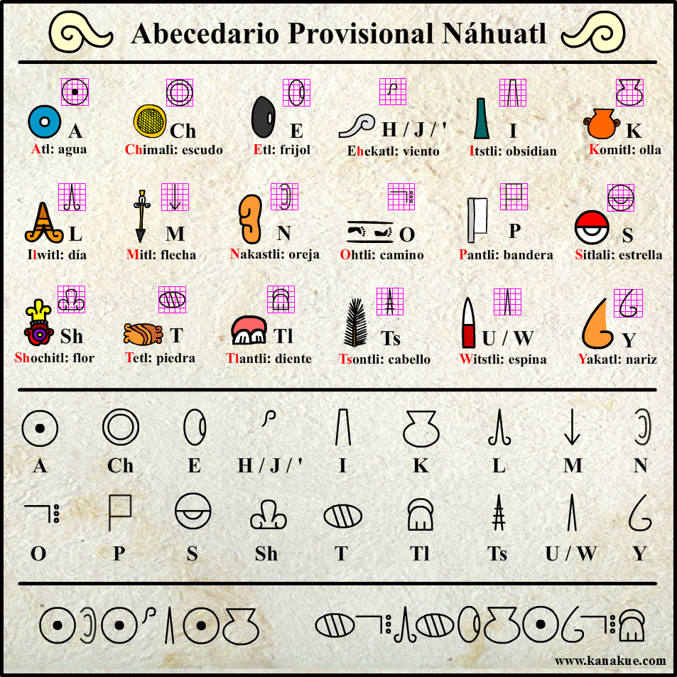

---
author:
  - name: Mariana Belén Cruz Rodríguez
    email: mariana.cruz68@unach.mx
    corresponding: true
  - name: Yofre Hernán García Gómez
    degrees: PhD
    email: yofre.garcia@unach.mx
    roles: supervisor
    corresponding: true
number-sections: true
crossref:
  eq-prefix: "Ecuación"
---

# Contexto y Planteamiento del Problema

## El alfabeto náhuatl y la preservación del patrimonio documental

El náhuatl es una de las lenguas más importantes de Mesoamérica, con una historia escrita que se remonta a siglos antes de la llegada de los españoles. Originalmes nahuas (llamados *tlacuilos*) utilizaban un sistema de glifos y pictogramas para registrar información histórica, tributaria y ceremonial en códices. Tras la conquista, se desarrolló una adaptación del alfabeto latino que incorporaba convenciones ortográficas específicas para representar los sonidos propios del náhuatl.

En la actualidad, han surgido propuestas de **sistemas de escritura intermedios** que buscan establecer un puente entre la tradición glífica ancestral y la escritura alfabética moderna. Un ejemplo es el siguiente abecedario provisional Náhuatl (ver @abcnauatl ), el cual asigna símbolos geométricos simplificados a los fonemas de la lengua, manteniendo cierta estética visual mesoamericana mientras facilita la transición hacia la lectoescritura.

{#abcnauatl fig-align="center"}

La preservación de estos documentos y sistemas de escritura no solo implica su conservación física, sino también su digitalización y análisis computacional para garantizar su accesibilidad a futuras generaciones. Sin embargo, este proceso enfrenta un desafío importante: la transcripción manual por parte de especialistas es un proceso lento, costoso y propenso a errores. En este contexto, el desarrollo de herramientas automatizadas de reconocimiento se vuelve crucial.

No obstante, a diferencia de los textos alfabéticos modernos, la naturaleza particular de estos sistemas de escritura representa un desafío de modelado matemático y computacional que requiere técnicas avanzadas de reconocimiento de patrones.

### El reto del reconocimiento óptico de caracteres en lenguas indígenas

El Reconocimiento Óptico de Caracteres (OCR, por sus siglas en inglés) ha alcanzado niveles de madurez notables para la digitalización de textos en lenguas mayoritarias con alfabetos estandarizados, como el español o el inglés. Sin embargo, su aplicación a sistemas de escritura indígenas, y particularmente a propuestas como el Abecedario Provisional Náhuatl, enfrenta desafíos que trascienden la ingeniería de software y se adentran en el aprendizaje automático.Algunos de estos desafíos son:

1.  **Variabilidad en la representación fonética:** A diferencia de un alfabeto estandarizado donde cada sonido tiene una representación única, en el náhuatl existe cierta flexibilidad en la elección del glifo para representar un fonema. Por ejemplo, para el sonido /e/, teóricamente se podría elegir entre el glifo de *etl* (frijol) o *elotl* (elote). Esta ambigüedad en el diseño ortográfico representa un desafío para la estandarización.

2.  **Falta de estandarización tipográfica:** No existe un "tipo de letra" único para estos sistemas. Cada material educativo, comunidad o institución puede emplear ligeras variantes de los símbolos, lo que genera una alta variabilidad en las formas geométricas que un sistema de reconocimiento debe procesar.

3.  **Ausencia de conjuntos de datos públicos:** A diferencia de alfabetos como el latino, para los cuales existen repositorios masivos y estandarizados (como EMNIST o MNIST), no existen bases de datos públicas de glifos náhuatl etiquetados. Esto limita severamente la aplicación directa de técnicas modernas de aprendizaje profundo que requieren grandes volúmenes de datos.

4.  **Variabilidad morfológica en el trazo:** Una vez establecida la elección del glifo para un fonema (por ejemplo, decidir que /e/ se representa con el glifo de "frijol"), el sistema debe ser capaz de reconocer dicho glifo independientemente de las variaciones en el trazo, la escala, la rotación o pequeñas deformaciones que introduzca el usuario al dibujarlo.

**Delimitación del problema de investigación:**

Para abordar este problema desde las matemáticas aplicadas, es necesario realizar una delimitación clara del alcance. Si bien la variabilidad en la elección del pictograma (frijol vs. elote) es un problema lingüístico relevante, su resolución excede el ámbito de esta tesis.

Por lo tanto, **este trabajo asume un sistema ortográfico fijo y estandarizado**: el Abecedario Provisional Náhuatl mostrado en la Figura @abcnauatl, donde se ha establecido de manera definitiva qué glifo representa a cada fonema. Bajo esta suposición, el problema se traslada al terreno del **reconocimiento de patrones**, el cual presenta desafíos matemáticos propios que justifican la comparación de dos enfoques fundamentales:

-   **Modelos Ocultos de Markov (HMM):** Que modelan la secuencia estocástica de los rasgos geométricos extraídos del trazo mediante procesos probabilísticos.

-   **Redes Neuronales Convolucionales (CNN):** Que aprenden las invariantes espaciales y topológicas directamente de la matriz de píxeles mediante optimización en espacios tensoriales.

La comparación sistemática de estos dos enfoques permitirá determinar qué arquitectura matemática es más robusta para reconocer los glifos de este sistema provisional, sentando las bases para futuras herramientas de digitalización del patrimonio lingüístico náhuatl.

## Planteamiento del Problema

El reconocimiento automático de patrones en sistemas de escritura no estandarizados presenta desafíos que exceden las capacidades de los algoritmos de reconocimiento óptico de caracteres (OCR) convencionales. Al centrar el estudio en el "alfabeto Náhuatl", el problema de investigación se formula desde la perspectiva de la modelación matemática y el aprendizaje automático, identificando dos grandes áreas de complejidad: la naturaleza morfológica de los glifos y la dicotomía entre los paradigmas de modelado estocástico y tensorial.

### Limitaciones de los enfoques tradicionales en glifos con alta variabilidad morfológica

Los sistemas de OCR tradicionales y los modelos de clasificación de imágenes estándar asumen la existencia de una tipografía subyacente o, al menos, una geometría rígida y estandarizada para cada clase (carácter). En el caso del alfabeto latino, la varianza entre distintas instancias de la misma letra es relativamente baja y puede ser modelada mediante transformaciones afines simples.

Sin embargo, los glifos del sistema provisional náhuatl poseen una naturaleza geométrica y pictográfica que rompe estos supuestos. Al no existir una fuente tipográfica digital oficial, cada instancia de un glifo (por ejemplo, el símbolo correspondiente a la sílaba "Tl") presenta variaciones significativas en la curvatura, la proporción de sus componentes y la continuidad de sus trazos.

Matemáticamente, esto se traduce en distribuciones de probabilidad de las características de la imagen con una varianza intra-clase extremadamente alta y, en muchos casos, no gaussiana. Los enfoques tradicionales, que dependen de la correlación de plantillas (template matching) o de la extracción manual de características geométricas rígidas, fallan al no poder generalizar sobre esta alta dispersión morfológica. Además, la degradación natural de los documentos físicos (ruido de alta frecuencia, manchas, pérdida de contraste) introduce incertidumbre en los bordes y contornos de los glifos, lo que exige modelos matemáticos intrínsecamente robustos al ruido y a las deformaciones locales.

### La dicotomía matemática: Modelos Generativos Secuenciales (HMM) vs. Modelos Discriminativos Tensoriales (CNN)

Para abordar la alta variabilidad morfológica descrita anteriormente, la literatura de visión por computadora y reconocimiento de patrones ofrece dos paradigmas matemáticos fundamentalmente distintos, cada uno con fortalezas y limitaciones teóricas particulares:

**1. El enfoque estocástico y secuencial (Modelos Ocultos de Markov - HMM):** Los HMM modelan el glifo no como una imagen estática, sino como la realización observable de un proceso estocástico secuencial. Al proyectar la imagen 2D en una secuencia 1D de características estructurales (como la distribución de "tinta", el centro de gravedad o las transiciones de bordes), el HMM utiliza matrices de transición y de emisión para capturar la probabilidad de evolución del trazo. \* *Ventaja matemática:* Poseen una sólida fundamentación en la teoría de la probabilidad, permiten cuantificar la incertidumbre y son altamente interpretables (es posible analizar las probabilidades de transición entre estados). \* *Limitación:* Dependen críticamente de la *ingeniería manual de características*. La proyección de 2D a 1D conlleva una pérdida irreversible de información topológica y espacial, y la matriz de emisión sufre la "maldición de la dimensionalidad" si el alfabeto de símbolos observables es demasiado grande.

**2. El enfoque de optimización en espacios tensoriales (Redes Neuronales Convolucionales - CNN):** Las CNN abordan el problema desde el análisis funcional y el álgebra lineal en espacios de alta dimensión. Al tratar la imagen como un tensor en $\mathbb{R}^{H \times W \times C}$, aplican operadores de convolución (productos internos locales) que aprenden de manera endógena (automática) filtros detectores de características jerárquicas. \* *Ventaja matemática:* Gracias a la compartición de parámetros y las operaciones de *pooling*, son naturalmente equivariantes a traslaciones y robustas a pequeñas deformaciones geométricas, eliminando la necesidad de diseñar características manuales. \* *Limitación:* Funcionan como modelos "caja negra" (baja interpretabilidad matemática de sus decisiones internas) y requieren una gran cantidad de datos para ajustar sus miles de parámetros mediante descenso de gradiente, evitando el sobreajuste.

**Formulación del problema de investigación:** Dada la escasez de datos etiquetados para lenguas indígenas (lo que penaliza a las CNN) y la complejidad geométrica de los glifos (lo que penaliza a los HMM por la pérdida de información espacial en la extracción de rasgos), no existe un consenso teórico sobre qué paradigma es óptimo para este dominio específico.

Por lo tanto, el problema central de esta tesis es determinar, mediante un protocolo experimental riguroso, **cuál de estos dos marcos matemáticos —la inferencia probabilística secuencial (HMM) o la optimización de funciones no lineales en tensores (CNN)— ofrece un mejor equilibrio entre precisión de clasificación, eficiencia computacional e interpretabilidad** para el reconocimiento de los glifos del alfabeto náhuatl, y bajo qué condiciones morfológicas cada modelo demuestra su superioridad.

### Justificación desde las Matemáticas Aplicadas

La elección de comparar Modelos Ocultos de Markov (HMM) y Redes Neuronales Convolucionales (CNN) para el reconocimiento de los glifos del alfabeto náhuatl no responde únicamente a tendencias tecnológicas, sino a la necesidad de evaluar dos paradigmas matemáticos fundamentalmente distintos para abordar un problema de clasificación de patrones con alta variabilidad morfológica. Desde la perspectiva de las matemáticas aplicadas, esta investigación se justifica a través de tres ejes teóricos principales:

#### Inferencia estocástica vs. Optimización en espacios tensoriales

El primer paradigma, representado por los HMM, aborda el reconocimiento de patrones desde la **teoría de la probabilidad y los procesos estocásticos**. En este enfoque, el glifo no se trata como un objeto geométrico estático, sino como la realización observable de un proceso secuencial. La inferencia del carácter se formula como un problema de máxima verosimilitud, donde el algoritmo de *Expectation-Maximization* (Baum-Welch) estima los parámetros de transición y emisión en un espacio de estados discretos. La fortaleza matemática de este modelo radica en su rigor probabilístico y su capacidad para cuantificar la incertidumbre inherente a los trazos degradados o ambiguos.

El segundo paradigma, representado por las CNN, se fundamenta en el **análisis funcional y la optimización no lineal en espacios de alta dimensión**. Aquí, la imagen se modela como un tensor en $\mathbb{R}^{H \times W \times C}$, y el reconocimiento se formula como la minimización de una función de pérdida (como la entropía cruzada) mediante el flujo de gradiente (descenso de gradiente estocástico). La justificación de este enfoque reside en su capacidad para aproximar funciones no lineales complejas y aprender operadores de convolución que actúan como detectores de características locales, sin requerir una modelación explícita de la dinámica subyacente del trazo.

Comparar ambos enfoques permite determinar si, para un sistema de escritura con alta varianza intra-clase, es más eficiente modelar la **dependencia secuencial de los rasgos** (HMM) o aprender la **invarianza topológica mediante composiciones de funciones no lineales** (CNN).

#### El tratamiento de la dimensionalidad y la invarianza geométrica

Un aspecto crucial en el reconocimiento de los glifos náhuatl es cómo cada modelo matemático gestiona la dimensionalidad de la entrada y las transformaciones geométricas.

Los HMM requieren una proyección del espacio bidimensional de la imagen ($\mathbb{R}^{28 \times 28}$) a una secuencia unidimensional de características discretas ($\mathbb{R}^T$). Matemáticamente, esta reducción de dimensionalidad conlleva una pérdida irreversible de información espacial y topológica, obligando al modelo a depender críticamente de la ingeniería manual de características (como el cálculo de momentos, perfiles y transiciones).

Por el contrario, las CNN operan directamente sobre el tensor de la imagen, preservando la estructura espacial local. Gracias a la propiedad de equivarianza por traslación inducida por la compartición de parámetros en los kernels convolucionales, y a la invarianza aproximada proporcionada por las operaciones de *pooling*, las CNN manejan las deformaciones geométricas (rotaciones, traslaciones y escalados) de manera endógena. Evaluar el impacto de estas dos estrategias de manejo de la dimensionalidad es esencial para entender los límites de cada modelo frente a la falta de estandarización tipográfica de los glifos.

#### Interpretabilidad matemática y escasez de datos

Finalmente, la investigación se justifica por la naturaleza del conjunto de datos. Al tratarse de un sistema de escritura indígena, no existen repositorios masivos de datos etiquetados, lo que impone un escenario de **aprendizaje con datos limitados**.

Los modelos probabilísticos como los HMM, al tener un espacio de parámetros mucho más restringido (matrices de transición y emisión) y estar guiados por supuestos estructurales fuertes (como la topología de Bakis para secuencias unidireccionales), suelen ser más robustos ante la escasez de datos y ofrecen una **interpretabilidad matemática directa**: es posible analizar las probabilidades de transición entre estados para entender cómo el modelo "decide" la clase.

En contraste, las CNN poseen miles de parámetros ajustables, lo que las hace propensas al sobreajuste en escenarios de pocos datos, requiriendo técnicas de regularización (como *Dropout* o *Weight Decay*) y aumentación de datos sintéticos. Además, su naturaleza de "caja negra" dificulta la interpretación de las decisiones internas.

Por lo tanto, esta tesis aporta valor a las matemáticas aplicadas al cuantificar formalmente el equilibrio entre **precisión, costo computacional, robustez ante datos limitados e interpretabilidad**, estableciendo un precedente metodológico para el procesamiento computacional de lenguas originarias y sistemas de escritura no estandarizados. \## 1.4 Objetivos

### Objetivo General

Comparar el desempeño de los Modelos Ocultos de Markov (HMM) con esquema de remuestreo *bootstrap* y las Redes Neuronales Convolucionales (CNN) en la clasificación de imágenes monocromáticas de glifos del alfabeto náhuatl. Dicha comparación se realizará mediante la implementación de ambos algoritmos bajo un protocolo experimental estandarizado, con el fin de determinar cuál enfoque ofrece el mejor equilibrio entre precisión de clasificación, costo computacional e interpretabilidad matemática para el reconocimiento automático de patrones.

### Objetivos Particulares

Para alcanzar el objetivo general, se plantean los siguientes objetivos particulares:

1.  **Preprocesar y caracterizar el conjunto de datos** de imágenes monocromáticas de glifos del alfabeto náhuatl, aplicando técnicas de normalización, aumentación geométrica y generación de ruido controlado, para establecer una base de evaluación estandarizada y robusta que permita la comparación equitativa de ambos modelos.

2.  **Implementar y ajustar un modelo de clasificación basado en Modelos Ocultos de Markov (HMM)** categóricos, integrado con un esquema de remuestreo *bootstrap*. El propósito es modelar la secuencia de características estructurales extraídas de los glifos y cuantificar la incertidumbre estadística en su identificación.

3.  **Diseñar y entrenar una arquitectura de Red Neuronal Convolucional (CNN)** optimizada para imágenes de baja resolución, formulando adecuadamente la función de pérdida y el proceso de optimización (ej. Adam), para extraer características espaciales jerárquicas y maximizar la precisión en la clasificación de las distintas clases de glifos.

4.  **Evaluar y comparar el rendimiento de ambos enfoques** (HMM y CNN) mediante métricas de desempeño (exactitud, precisión, exhaustividad y función de pérdida), tiempos de convergencia y requerimientos de recursos computacionales, para identificar las ventajas, limitaciones y el ámbito de aplicabilidad de cada método en el contexto del reconocimiento de patrones glíficos.